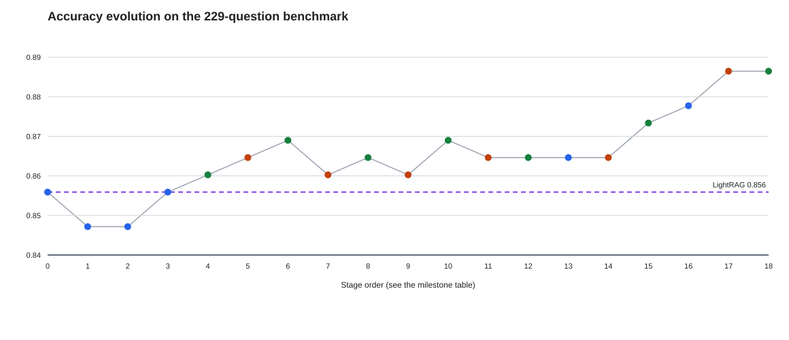
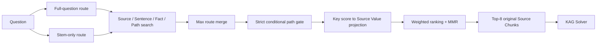

# KAG Grounded KV3

細粒度の検索Keyで根拠候補を見つけ、回答層には監査可能な原文Valueだけを渡す、日本語QA向けのGrounded Retrieval実験です。

> このリポジトリは、KAG/LightRAG比較研究の公開可能な実装を独立パッケージとして再構成したものです。公開Demoはオリジナルの合成データを使用し、研究用教材・設問・企業内データ・個人情報を含みません。

## Highlights

- 最終方式は `KAGGroundedKV3 / kv_conditional_path`。
- Source、Sentence、Fact、Pathを検索Keyとして利用し、最終出力は原文Source Chunkに限定。
- 229問の研究内評価では、Finalizerなしで `201/229 (0.878)`、Legacy/Guarded Finalizerで `203/229 (0.886)`。
- LightRAG official hybridの `196/229 (0.856)` をAccuracyでは上回った一方、Evidence Recallは `0.727` で、LightRAGの `0.840` より低い。
- 成功した結果だけでなく、Evidence Recallのみ上回った方式、失敗したGraph設計、事前Gateで不採用となった候補も公開可能な集計値として記録。



## Architecture



生成したSentence、Fact、Pathは位置特定のためのKeyです。Solverへ渡すValueは原文Chunkだけです。この分離により、検索粒度を細かくしながら、回答根拠の出所を維持します。

詳細は [Architecture](docs/architecture.md) を参照してください。

## Final scoring

```text
score = 0.64 * direct source
      + 0.16 * sentence
      + 0.10 * grounded fact
      + 0.10 * gated path
```

- Full questionとstem-onlyを独立検索。
- 同じKeyのroute scoreは加算せず最大値を採用。
- Pathは複数Source、全hopの原文引用、異なるendpoint、query relevanceを満たす場合だけ採用。
- 上位候補から `0.85 relevance - 0.15 redundancy` のMMRでTop-8を選択。

## Quick start

Python 3.10以降だけで合成Demoを実行できます。

```bash
python -m venv .venv
source .venv/bin/activate
python -m pip install ".[dev]"
python -m kag_grounded_kv3
python -m kag_grounded_kv3.evaluation
pytest
```

JSON出力：

```bash
grounded-kv3-demo --json
```

Neo4j/OpenSPG連携はオプションです。接続情報は環境変数または呼び出し側から明示的に渡し、リポジトリ内には保存しません。

## Research result

| System | Accuracy | Evidence Recall | Mean latency |
|---|---:|---:|---:|
| LightRAG official hybrid | 196/229 (0.856) | **0.840** | 5.87s |
| KAG official iterative | 194/229 (0.847) | 0.751 | 4.90s |
| KV3 Conditional Path / Off | **201/229 (0.878)** | 0.727 | 5.21s |
| KV3 Conditional Path / Legacy | **203/229 (0.886)** | 0.727 | 10.11s |
| KV3 Conditional Path / Guarded | **203/229 (0.886)** | 0.727 | 15.04s |

ここで「上回った」はAccuracyの数値比較です。Finalizer条件、Graph構造、Chunk表現は完全には同一ではなく、LightRAGに対する統計的優越を主張するものではありません。

- [研究の演進と全結果](docs/evolution.md)
- [実験設計と評価](docs/experiment-report.md)
- [研究Integrityと非公開境界](docs/research-integrity.md)
- [制約と今後の課題](docs/limitations.md)
- [公開集計CSV](results/evolution_metrics.csv)
- [Candidate gate summary](results/kv_conditional_path_gate_summary.json)

## Repository map

```text
src/kag_grounded_kv3/       grounding and standalone retrieval package
examples/synthetic_ja/      public synthetic example
tests/                      deterministic unit tests
results/                    aggregate research metrics only
docs/                       design, evolution, evaluation, limitations
scripts/                    chart rendering and publication checks
```

## Disclosure

- 研究内の229問benchmarkと教材本文は公開しません。
- 公開Demoの成績は研究内評価値の再現を意味しません。
- 集計結果には成功方式だけでなく、失敗・不採用方式も含めています。
- OpenSPG KAGはvendorせず、オプションAdapterと引用だけを提供します。
- 職歴、業務事例、氏名、連絡先などの個人情報は含めません。
