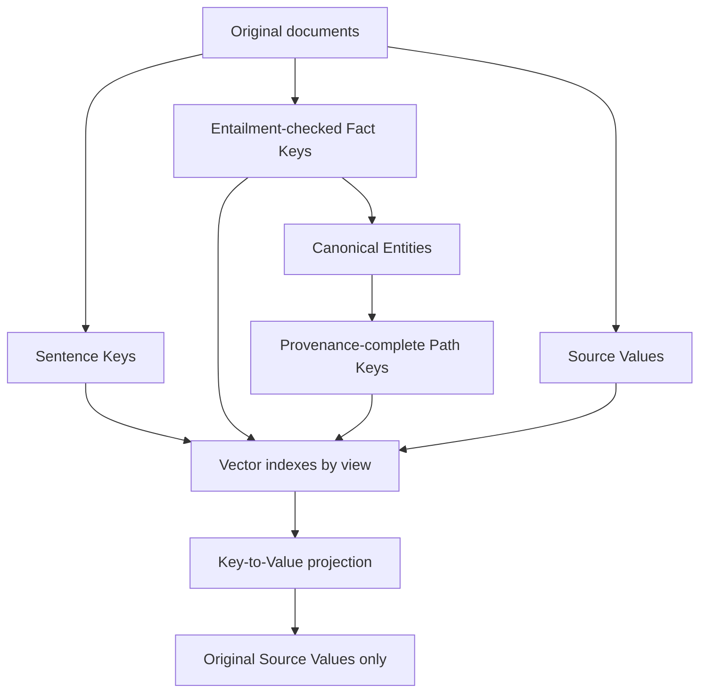
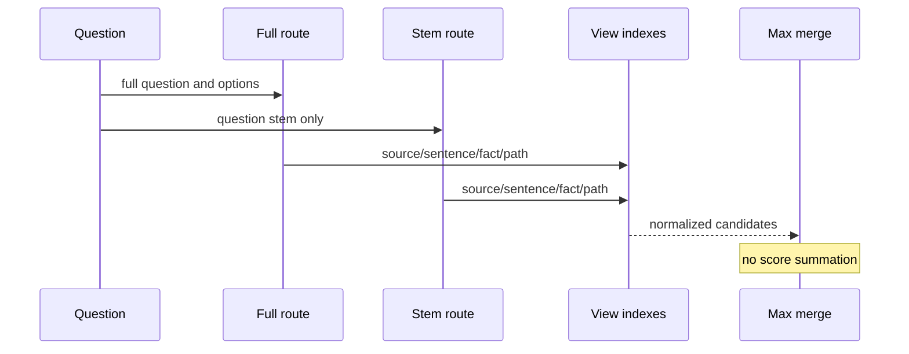
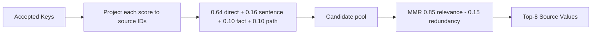

# Architecture / アーキテクチャ

## 日本語

### 1. KeyとValueの分離

Grounded KV3では、Sentence、Fact、Entity Pathを検索しやすいKeyとして利用し、回答に使用するValueを原文Source Chunkに限定します。

研究内Graphは、378個の400/50 Source Value、2,508 Sentence Key、1,190件のentailment確認済みFact、1,807 Canonical Entity、149 Strict Pathから構成しました。2,170件のFact候補のうち、原文から十分に含意されない980件を除外しています。

### 2. Query routing

Stem候補は、Full routeの上位16件に存在しない場合、または正規化scoreが0.05以上改善する場合だけ追加します。

### 3. Conditional path gate

Pathは次の条件をすべて満たす場合だけ使用します。

1. Path scoreがFull routeのSource cutoff以上。
2. 二つ以上の異なるSource Valueへ接続。
3. 全hopに原文引用が存在。
4. AnchorとTargetが異なるEntity。
5. Queryが少なくとも一方のendpointを含み、さらに両endpoint、predicate、または追加score marginのいずれかを満たす。

大量のPathを固定quotaで入れる方式ではありません。実験ではPath signalが最終Valueに現れたのは4件だけでしたが、Source Projectionの198問からConditional Pathの201問へ改善しました。

### 4. Ranking and output

`RetrievalResult.audit`にはroute、weight、選択Source IDを残し、選択理由を追跡可能にします。

### 5. Public adapter boundary

- `InMemoryIndex`：依存なしの合成Demo。
- `Neo4jVectorIndex`：呼び出し側がembedding関数と接続情報を注入。
- `JsonGraphStore`：公開可能なSource/Path exportを読み込み。
- `to_openspg_output`：必要な環境だけでKAG `RetrieverOutput`へ変換。

接続passwordにdefault値はありません。
