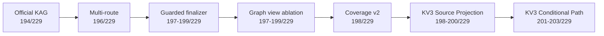
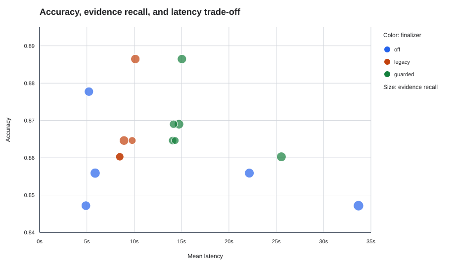

# Research Evolution / 研究の演進

## 読み方

本ページは、良い結果だけを並べるためのものではありません。各段階で何を疑い、何を変更し、どの指標が改善し、次にどの問題が見えたかを記録します。

LightRAG official hybridを共通の数値baselineとします。

```text
Accuracy: 196/229 = 0.856
Evidence Recall: 0.840
Mean latency: 5.87s
```

## Timeline




## Full milestone table

| Stage | System | Correct | Accuracy | Evidence Recall | Latency | Interpretation |
|---|---|---:|---:|---:|---:|---|
| Baseline | LightRAG official hybrid | 196 | 0.856 | 0.840 | 5.87s | 共通baseline |
| Start | KAG official iterative | 194 | 0.847 | 0.751 | 4.90s | 近いAccuracyだがretrieval gap |
| Evidence | KAG static hybrid choice | 194 | 0.847 | **0.882** | 33.69s | Evidenceはbaseline超、回答Accuracyは未達 |
| Retrieval | KAG iterative hybrid / Off | 196 | 0.856 | 0.788 | 22.16s | Accuracyを追平、latency大 |
| Finalizer | KAG hybrid / Guarded | 197 | 0.860 | 0.788 | 25.54s | 一問改善、evidence不変 |
| Finalizer | Old KAG / Legacy | 198 | 0.865 | 0.751 | 8.92s | 四問改善、empty output 1件 |
| Finalizer | Old KAG / Guarded | 199 | 0.869 | 0.751 | 14.72s | 5 gains / 0 losses |
| Graph v1 | Multi / Legacy | 197 | 0.860 | 0.592 | 8.48s | 派生viewが原文を圧迫 |
| Graph v1 | Multi / Guarded | 198 | 0.865 | 0.592 | 14.05s | Accuracyとevidenceが乖離 |
| Graph v1 | Composite / Legacy | 197 | 0.860 | 0.587 | 8.48s | Fact/Summary/Path混在 |
| Graph v1 | Composite / Guarded | 199 | 0.869 | 0.587 | 14.15s | 高Accuracyでもgrounding不足 |
| Coverage v2 | Multi / Legacy | 198 | 0.865 | 0.501 | 9.79s | coverage拡大だけでは不十分 |
| Coverage v2 | Multi / Guarded | 198 | 0.865 | 0.501 | 14.32s | 固定quotaの限界 |
| KV3 | Source Projection / Off | 198 | 0.865 | 0.727 | - | Key/Value分離で回復 |
| KV3 | Source Projection / Legacy | 198 | 0.865 | 0.727 | - | Gate 199に未達 |
| KV3 | Source Projection / Guarded | 200 | 0.873 | 0.727 | - | 単一modeの成功では採用しない |
| Final | Conditional Path / Off | 201 | 0.878 | 0.727 | 5.21s | Finalizerなしでbaseline超 |
| Final | Conditional Path / Legacy | 203 | 0.886 | 0.727 | 10.11s | 最高Accuracy |
| Final | Conditional Path / Guarded | 203 | 0.886 | 0.727 | 15.04s | 2 override、227 fallback |

全数値は [evolution_metrics.csv](../results/evolution_metrics.csv) にあります。

## Stage 1: Evidenceを増やせば正答できるか

**問題**：Official KAG iterativeは `194/229` で、LightRAGより2問少なかった。

**仮説**：Full question、stem、option、graph fact、lexical sourceを組み合わせれば、Evidence RecallとAccuracyを同時に改善できる。

**結果**：KAG iterative hybridは `196/229` でLightRAGに追いつき、Evidence Recallも `0.751→0.788` へ改善した。しかし平均Latencyは `22.16s` まで増えた。

**別の重要結果**：Static hybrid choice方式はAccuracy `0.847` に留まった一方、Evidence Recall `0.882` でLightRAGの `0.840` を上回った。証拠を多く取得するだけでは、最終選択肢の正答に直結しない。

## Stage 2: Finalizerで安全に修正できるか

**問題**：Evidenceが存在しても、Solverの選択肢判断や出力形式が不安定だった。

**仮説**：同一runのquestion、draft、evidenceだけで再判断し、危険な変更を拒否すればcorrect-to-wrongを防げる。

**結果**：Old KAG + Legacyは198問、Guardedは199問。最終Guardedでは5件のwrong-to-correct、0件のcorrect-to-wrongだった。Hybrid + Guardedも197問へ改善した。

**副作用**：Evidence Recallは変わらず、Guardedは追加推論によってLatencyが増える。これはretrieval改善ではなくanswer-selection改善である。

## Stage 3: Graph viewを増やせばよいか

**問題**：原文Chunkだけでは細粒度の概念やmulti-hop relationを検索しにくい。

**仮説**：Fact、Summary、Pathなどの派生viewを同じ候補poolに追加する。

**結果**：Composite + Guardedは199問まで向上したが、Source Evidence Recallは `0.587`。Multi-granular + Guardedも198問、Recall `0.592` だった。

**判断**：派生viewは問題語に強く反応する一方、完全な答え条件を含むSource passageをTop-8から押し出した。

## Stage 4: Coverageを増やせば解決するか

**変更**：Fact-bearing passage coverageを `0.489→0.925` に拡大し、view別index、full/stem RRF、MMR、固定quotaを導入した。

**結果**：Multi Coverage v2は198問だったが、Evidence Recallは `0.501`。抽出数を増やしても、Top-8のValue選択は改善しなかった。

**学び**：Keyの量ではなく、Key scoreを原文Valueへ正しく投影する必要がある。

## Stage 5: Grounded Key-Value Graph

**Source Projection**：Sentence/FactなどのscoreをSourceへ投影し、Offで198問、Guardedで200問。Evidence Recallは約0.727まで回復した。

ただし事前に設定したLegacy `≥199` gateに対して198問だったため、候補全体として不採用にした。Guardedだけの200問を理由にGateを変更しなかった。

**Conditional Path**：厳密なprovenanceとquery relevanceを満たすPathだけを0.10 weightで追加。Off 201、Legacy/Guarded 203で全Gateを通過したため、PPR/Verifier backupは正式full runせず探索を終了した。

## Remaining gap

Candidate poolのEvidence Recallは `0.905`、Top-8は `0.727` で、約0.178の差がある。次の改善対象は無制限なGraph expansionではなく、Source reranking、query-dependent evidence budget、direct channelとexpansion channelの分離である。



## Comparison caution

- 全方式は同じ229問を評価したが、Graph、Chunk表現、Finalizer条件は完全には同一ではない。
- LightRAGとの差についてpaired significance testは実施していない。
- Finalizer-onのAccuracyとLightRAG no-finalizerを同条件の優越性として扱わない。
- 公開Demoはアルゴリズム確認用であり、非公開benchmarkの数値を再現しない。
