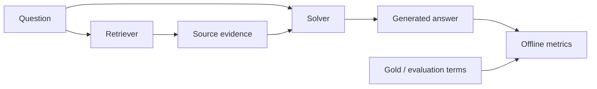

# Research Integrity and Disclosure Boundary

## 公開しているもの

- Grounded Key-Value Retrievalの公開用再構成。
- `kv_conditional_path`のroute merge、Path gate、Source projection、weighted ranking、MMR。
- オリジナルの日本語合成データとdeterministic test。
- 研究内実験の集計値、Candidate gate、失敗結果、制約。
- 公開可能なCandidate gateと集計結果。

## 公開していないもの

- 著作権のある教材本文とそのChunk。
- 過去問、正答、expected terms、evidence terms。
- 問題別の回答JSON、Cache DB、Neo4j dump、Embedding。
- ローカルpath、内部address、credential。
- 企業のcode、service名、table/index名、dashboard screenshot、traffic規模。
- 職歴、氏名、連絡先、住所などの個人情報。

## Leakage controls

Retriever入力はQuestionだけです。Solver入力はQuestionと同runのSource Chunkだけです。Goldと評価用termは生成終了後のmetric関数だけが読みます。

テストでは以下を確認します。

- Development 160件とValidation 69件がdisjoint。
- Candidate設定にGold由来fieldが存在しない。
- Full/stem scoreをsumせずmax mergeする。
- Solver出力がSource Valueだけである。
- Finalizer間でEvidence ID/hashが変わらない。

## Result provenance

`results/kv_conditional_path_gate_summary.json`には公開可能なCandidate gateだけを保存しています。元の229問artifactと、その保存場所や識別情報は非公開のため、公開Demoのテスト値と研究内Accuracyを同一視しません。

## AI usage

研究実装では、コード補助、実験設計の論点整理、文書校正に生成AIを使用しました。評価方法、公開可否、最終コード、実験結果の解釈はrepository maintainerが確認しています。Gold情報を検索・生成promptへ投入する用途には使用していません。
